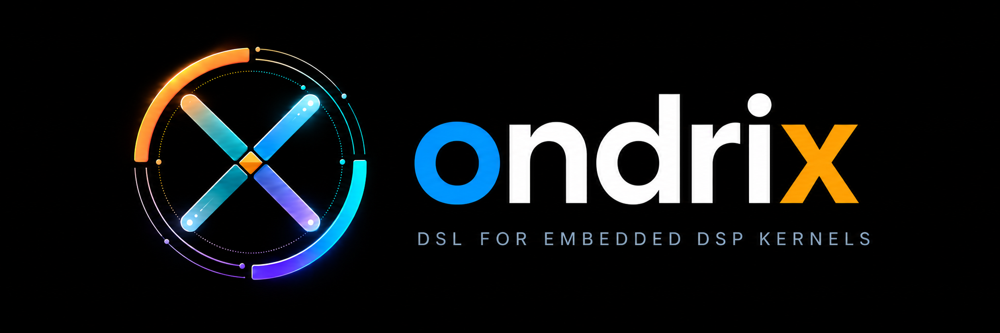

# ondrix

<p align="center">
  
</p>

ondrix is a language and compiler framework for portable embedded DSP kernels.
It separates algorithm intent, target-independent numeric semantics, and
target capabilities in a layered MLIR stack, with AOT code generation as the
primary execution model.

The intended compilation flow is:

```text
ondrix language
  -> ondrix dialect
  -> ondsp dialect
  -> generic scalar, generic Vector, or ortumcore path
  -> LLVM dialect / LLVM IR
  -> object file or firmware integration
```

The three project dialects have distinct responsibilities:

- `ondrix` preserves DSP algorithm and kernel intent.
- `ondsp` defines target-independent numeric and accumulator semantics.
- `ortumcore` represents abstract target capabilities without exposing
  private instruction encodings or physical registers.

Textual MLIR remains the complete development and debugging entry point. An
experimental standalone `.ox` frontend now supports signed-Q15/Q31
dot/FIR-sample kernels, immutable inline fixed-point FIR coefficients, and f32
dot kernels through scalar AOT execution. The repository also
includes executable signed-Q15 and signed-Q31 scalar/fixed-width Vector AOT
paths for FIR samples, full-output FIR, explicit-state streaming FIR, and dot
products. Full-output and streaming contracts remain experimental; the
streaming Vector-reuse path materializes state/input concatenation and is not
a zero-copy implementation. Public emulation covers the OrtumCore signed
i40/frac30 saturating accumulator with Q15 full-product MAC. The source
language surface and additional target consumers remain under development.

## Documentation

- [Documentation index](docs/README.md)
- [Current implementation status](docs/status.md)
- [Experimental `.ox` frontend](docs/frontend-language.md)
- [Fixed-point semantics](docs/fixed-point-semantics.md)

## Build

ondrix tracks LLVM/MLIR 17.0.6 at commit
`6009708b4367171ccdbf4b5905cb6a803753fe18`. This is the tested baseline.
Other LLVM 17 revisions are accepted with a configuration warning for
migration experiments; other major versions are rejected.

Configure against an external LLVM/MLIR build:

```sh
cmake -G Ninja \
  -S /path/to/ondrix \
  -B /path/to/ondrix/build \
  -DMLIR_DIR=/path/to/llvm-project/build/lib/cmake/mlir \
  -DLLVM_DIR=/path/to/llvm-project/build/lib/cmake/llvm \
  -DLLVM_EXTERNAL_LIT=/path/to/llvm-project/build/bin/llvm-lit
```

Build and run the regression suite:

```sh
ninja -C /path/to/ondrix/build ondrix-opt
ninja -C /path/to/ondrix/build check-ondrix
```

## License

Licensed under the [Apache License 2.0](LICENSE).
